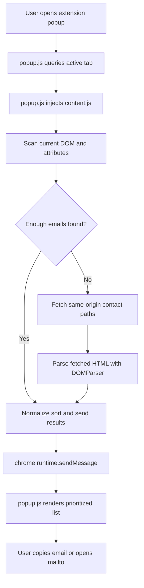

# HTML Email Parser

> Extract business contact emails from live websites with a Chrome Extension that performs deep DOM scanning, de-obfuscation, and background contact-page discovery.

[](https://chromewebstore.google.com/search/OstinUA)
[](https://ostinua.github.io/Chrome-Web-Store_Developer-List/)

[](manifest.json)
[](manifest.json)
[](LICENSE)

HTML Email Parser is a lightweight browser automation utility for lead generation, sales operations, and business development workflows. The extension scans the active tab for contact information, normalizes obfuscated email patterns, and falls back to common contact-related routes such as `/contact`, `/about`, and `/support` when the landing page does not expose a visible mailbox.

> [!IMPORTANT]
> This repository contains a Chrome Extension, not a general-purpose logging library. The documentation below reflects the actual implementation shipped in this codebase.

## Table of Contents

- [Features](#features)
- [Tech Stack & Architecture](#tech-stack--architecture)
  - [Core Technologies](#core-technologies)
  - [Project Structure](#project-structure)
  - [Key Design Decisions](#key-design-decisions)
- [Getting Started](#getting-started)
  - [Prerequisites](#prerequisites)
  - [Installation](#installation)
- [Testing](#testing)
- [Deployment](#deployment)
- [Usage](#usage)
- [Configuration](#configuration)
  - [Manifest Permissions](#manifest-permissions)
  - [Runtime Controls](#runtime-controls)
  - [Scanning Strategy](#scanning-strategy)
- [License](#license)
- [Contacts & Community Support](#contacts--community-support)

## Features

- Deep client-side email extraction from visible text nodes and rendered DOM content.
- Attribute-aware scanning for `href`, `title`, `placeholder`, `alt`, `aria-label`, `data-email`, `data-contact`, `src`, and `srcset` values.
- `mailto:` URL cleanup, query-string stripping, and result normalization before presentation.
- De-obfuscation of common anti-scraping formats such as `name [at] domain [dot] com`, `name (at) domain (dot) com`, and Unicode full-width separators.
- Cloudflare `data-cfemail` decoding to recover addresses protected by email obfuscation.
- Reverse-string detection for mailboxes embedded as reversed text blobs.
- Concatenated string recovery for email addresses split across JavaScript-style quoted fragments.
- False-positive suppression for image assets, hashed strings, noisy telemetry artifacts, and bundled resource names.
- Business-oriented result prioritization that promotes high-value inboxes such as `ads@`, `marketing@`, `sales@`, `contact@`, `info@`, and `support@`.
- Background augmentation that fetches common contact-oriented routes from the current origin without opening extra tabs.
- Root-page aware fallback behavior that expands scanning when the current page is likely a homepage or no email is discovered locally.
- Time-bounded execution model with a hard stop to reduce the risk of runaway scans on large or hostile pages.
- Popup-driven UX with email listing, clipboard copy, `mailto:` launch, and manual refresh controls.
- Manifest V3-compatible packaging with a service worker background script.
- Zero build-step local development workflow: clone, load unpacked, and test immediately in Chrome.

## Tech Stack & Architecture

### Core Technologies

- JavaScript (plain ES2019+ style browser scripting).
- Chrome Extension Manifest V3 APIs.
- DOM traversal via `TreeWalker`, `querySelectorAll`, and `DOMParser`.
- Browser `fetch()` for same-origin background HTML retrieval.
- Static HTML and CSS for popup rendering.
- Apache License 2.0 for open-source distribution.

### Project Structure

```text
HTML-Email-parser/
├── LICENSE
├── README.md
├── background.js
├── content.js
├── manifest.json
├── popup.html
├── popup.js
├── styles.css
└── icons/
    └── icon128.png
```

### Key Design Decisions

#### 1. Content-Script-First Extraction

The extension injects `content.js` into the active tab, keeping extraction logic close to the live DOM. This makes it possible to inspect text nodes, attributes, and rendered page content without requiring external services.

#### 2. Background Contact-Page Augmentation

If the page yields too few results, the scanner requests additional HTML from common contact routes on the same origin. This improves recall for sites that keep inboxes off the homepage.

> [!NOTE]
> Contact-page augmentation only targets same-origin candidate paths already defined in the extension source. It does not crawl arbitrary domains.

#### 3. Defensive Normalization Pipeline

The extraction logic uses layered normalization steps to maximize signal quality:

1. Decode HTML entities.
2. Normalize Unicode separators and invisible characters.
3. Translate obfuscated `at` and `dot` patterns.
4. Remove `mailto:` prefixes and trailing query strings.
5. Filter out image-like and garbage-like false positives.
6. Score and sort business-relevant addresses.

#### 4. Bounded Runtime

A runtime ceiling prevents the scanner from consuming unbounded page resources. This is especially useful on very large documents, SPAs, or pages with deeply nested markup.

> [!WARNING]
> The scanner intentionally caps results and runtime. If you need exhaustive bulk extraction, you may need to tune the constants in `content.js` and validate performance on representative sites.

#### 5. Thin Background Worker

`background.js` is intentionally minimal because the extension primarily relies on popup and content-script messaging. This keeps the service worker easy to audit and compatible with Chrome's MV3 lifecycle model.

#### Data Flow Overview



#### High-Level Component Responsibilities

| Component | Responsibility |
| --- | --- |
| `manifest.json` | Declares permissions, popup entrypoint, icons, and background worker. |
| `content.js` | Performs extraction, de-obfuscation, fallback fetching, sorting, and messaging. |
| `popup.js` | Injects the scanner, renders results, and exposes copy / mail actions. |
| `popup.html` | Defines popup layout and static UI shell. |
| `styles.css` | Styles the popup list, buttons, metadata, and responsive behavior. |
| `background.js` | Maintains a minimal MV3 service worker message responder. |

## Getting Started

### Prerequisites

Before loading the extension, ensure you have the following:

- Google Chrome or another Chromium-based browser with Manifest V3 support.
- Access to `chrome://extensions` in developer mode.
- Git, if you plan to clone the repository instead of downloading a ZIP archive.
- No Node.js, Python, Docker, or package manager installation is required for the current codebase.

### Installation

#### Option 1: Clone the Repository

```bash
git clone https://github.com/<your-account>/HTML-Email-parser.git
cd HTML-Email-parser
```

#### Option 2: Load as an Unpacked Extension

1. Open Chrome and navigate to `chrome://extensions`.
2. Enable `Developer mode`.
3. Click `Load unpacked`.
4. Select the repository root containing `manifest.json`.
5. Confirm that the extension appears in the extension list with version `1.0.11`.

> [!TIP]
> Pin the extension to the browser toolbar while testing. It makes iterative scans and manual refreshes much faster.

## Testing

This repository does not currently include an automated unit test suite, integration harness, or linter configuration. Validation is primarily manual and browser-based.

### Recommended Manual Validation

1. Load the unpacked extension in Chrome.
2. Visit a page that exposes a visible email address.
3. Open the popup and confirm the address appears in the list.
4. Visit a site whose homepage does not show email addresses but whose `/contact` or `/about` route does.
5. Use the popup refresh button to verify fallback retrieval still returns results.
6. Test an obfuscated address format such as `hello [at] company [dot] com`.
7. Validate that `Copy` writes to the clipboard and `Mail` opens the system mail client.

### Repository-Level Checks

Use the following commands to validate the static project files locally:

```bash
python -m json.tool manifest.json
```

```bash
git diff -- README.md manifest.json popup.html popup.js content.js background.js styles.css
```

> [!NOTE]
> If you plan to expand this project, adding an end-to-end Playwright or Puppeteer test harness would provide stronger regression protection for popup messaging and content-script behavior.

## Deployment

Because this project is a browser extension, deployment typically means packaging and distributing the extension rather than deploying a long-running server process.

### Production Packaging

1. Verify the extension version in `manifest.json`.
2. Confirm icons, popup assets, and scripts are present at the repository root.
3. Run a final manual smoke test in Chrome.
4. Create a ZIP archive of the extension contents for release distribution.

Example packaging command:

```bash
zip -r html-email-parser.zip manifest.json background.js content.js popup.html popup.js styles.css icons LICENSE README.md
```

### Chrome Web Store Readiness Checklist

- Increment the version before each published release.
- Review requested permissions and remove anything unnecessary.
- Confirm all strings shown to end users are production-ready.
- Re-test on representative target sites, especially sites that use obfuscated or dynamically rendered contact information.

### CI/CD Guidance

The repository does not currently include a CI workflow. If you introduce one, a pragmatic pipeline would include:

- JSON validation for `manifest.json`.
- Static syntax checks for JavaScript files.
- Optional browser-based smoke tests for popup injection and result rendering.
- Artifact packaging for release candidates.

> [!CAUTION]
> Chrome Extension releases are sensitive to permission changes. Any additional host permissions or API access may require renewed user trust and store review scrutiny.

## Usage

### Basic End-User Flow

1. Open a target website in Chrome.
2. Click the extension icon.
3. Wait for the scan to complete.
4. Review the discovered emails in the popup.
5. Click `Copy` to copy an address or `Mail` to open a `mailto:` link.
6. Click `Обновити` if you want to force a fresh scan.

### What the Popup Does Internally

```javascript
// popup.js
// Query the active tab, inject the content script, and render results
const [tab] = await chrome.tabs.query({ active: true, currentWindow: true });
await chrome.scripting.executeScript({
  target: { tabId: tab.id },
  files: ["content.js"]
});

chrome.runtime.onMessage.addListener((msg, sender) => {
  if (msg?.action === "saveEmailsForTab") {
    renderList(msg.emails || []);
  }
});
```

The popup acts as the UI orchestrator. It resolves the active tab, injects the scanner, listens for `saveEmailsForTab` messages, and refreshes the rendered email list when new results arrive.

### Core Scanning Pattern

```javascript
// content.js
// Extract emails from the current document, then optionally fetch contact pages
let merged = new Set(scanCurrentDocument() || []);

if (merged.size < MAX_EMAILS) {
  const contactEmails = await fetchAndScanContactPages(window.location.origin);
  contactEmails.forEach(email => merged.add(email));
}

sendResults(Array.from(merged), true);
```

This two-phase model keeps the local page scan fast while still giving the extension a recovery path when the homepage does not expose contact details directly.

### Example Target Patterns the Extension Handles

```text
sales@example.com
hello [at] company [dot] io
marketing (at) startup . co
moc.elpmaxe@ofni
```

> [!TIP]
> For the highest-quality results, test the extension on root pages first. The fallback contact-path strategy is most effective when the current page shares the same origin as the site's public contact pages.

## Configuration

The project does not currently expose a user-editable `.env` file, CLI startup flags, or a packaged configuration module. Configuration is implemented directly in the source files.

### Manifest Permissions

The extension requests the following capabilities:

| Permission | Why it is needed |
| --- | --- |
| `activeTab` | Allows the extension to work against the currently focused browser tab. |
| `scripting` | Enables runtime injection of `content.js`. |
| `clipboardWrite` | Supports the popup copy-to-clipboard action. |
| `tabs` | Allows popup logic to inspect the active tab title and URL. |
| `host_permissions: <all_urls>` | Permits scanning and same-origin contact-page fetching on arbitrary websites opened by the user. |

### Runtime Controls

The main runtime tuning values live in `content.js`:

| Constant | Default | Purpose |
| --- | --- | --- |
| `MAX_EMAILS` | `4` | Limits how many emails are needed before fallback behavior can stop. |
| `MAX_RUN_MS` | `60000` | Caps total scanner runtime to approximately 60 seconds. |
| `VERBOSE` | `window.__EMAIL_FINDER_VERBOSE` | Enables diagnostic console logging when truthy. |

### Scanning Strategy

The scanner combines multiple passes:

- Text-node traversal with `TreeWalker`.
- Element-level inspection across common text-bearing tags.
- Attribute extraction for likely contact-bearing properties.
- HTML entity decoding and Unicode normalization.
- Style-block scanning for email-like fragments embedded in CSS or inline payloads.
- Same-origin fetches against a curated contact-path allowlist.

### Candidate Fallback Routes

The current implementation attempts these paths when additional discovery is needed:

```text
/contact
/contact/
/contact-us
/contact-us/
/contacts
/contacts/
/about
/about/
/support
/support/
/help
/help/
```

### UI Strings

The popup currently includes a Ukrainian refresh label and helper tip:

- Button label: `Обновити`
- Footer hint: `Tip: Якщо пошта одразу не знайшлась, натисніть "Обновити"`

If you want a fully English UX, update the static strings in `popup.html` and any corresponding text logic in `popup.js`.

## License

This project is distributed under the Apache License 2.0. See [`LICENSE`](LICENSE) for the full legal text.

## Contacts & Community Support

## Support the Project

[](https://www.patreon.com/OstinFCT)
[](https://ko-fi.com/fctostin)
[](https://boosty.to/ostinfct)
[](https://www.youtube.com/@FCT-Ostin)
[](https://t.me/FCTostin)

If you find this tool useful, consider leaving a star on GitHub or supporting the author directly.
